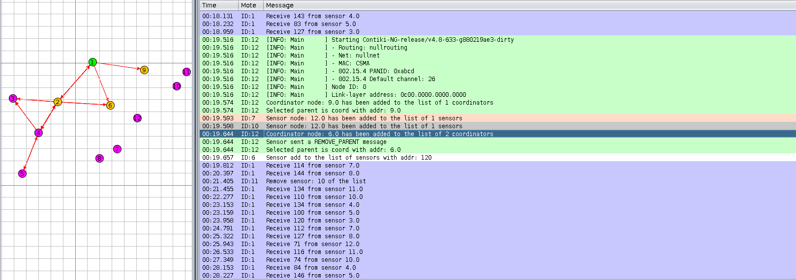

# LINFO2146
Mobile &amp; Embedded Devices Project

Once the serial socket server is listening on the border routeur, it can be accessible with the python server:

    python3 server.py --ip=172.17.0.2 --port=60001
    
Note: the ip is the default one of the docker found while launching cooja with the course VM.

  

Here is the normal execution of our code on the give topology. As we can see, Border router receives correctly all data in the good order. 

When a new sensor node is added on the topolgy, We can see that it chooses the nearest coordinator as master node and all the algorithm is adapted to include it to the topology.

When a sensor node is deleted, the coordinator will detect it and notify the border router

When a sensor node is added to an other sensor node, without detecting coordinator, we can see that the master sensor will add him to its list and the algorithm will add it in the topology.